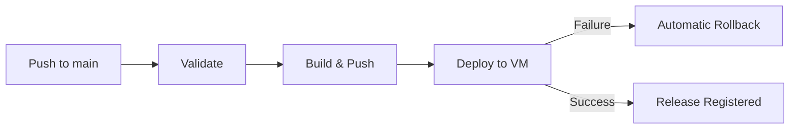

# BHIV TTV – Production Infrastructure & Deployment Guide

This document specifies the deployment infrastructure, container orchestration, CI/CD pipeline, and operations manual for the **BHIV Text-to-Video (TTV)** microservice and frontend UI.

---

## 1. System Architecture & Topology

- **Service Model**: Multi-container architecture with isolated backend and frontend services:
  - **`ttv-service` (Backend)**: High-performance FastAPI / Uvicorn service executing the full AI video generation pipeline.
  - **`ttv-frontend` (Frontend)**: Lightweight `nginx:alpine` container serving static frontend UI assets (`index.html`, `app.js`, `style.css`).
  - **Host Reverse Proxy**: An external Nginx instance deployed directly on the production VM handles domain resolution, SSL termination, and routes requests to the container ports.
- **Generation Pipeline**:
  `Text Prompt` → `LLM / Story Generation` → `Scene Planning` → `Image Synthesis` → `Video Engine (OpenCV)` → `TTS (EdgeTTS/gTTS/Local)` → `Audio Mixing` → `FFmpeg Rendering` → `MP4 + Sidecar Metadata`.
- **Port Allocation**:
  - **Frontend Service (`ttv-frontend`)**:
    - Container Port: `8000/TCP`
    - Host Port Mapping: `8021:8000` (Port `8021` allocated on production VM)
  - **Backend Service (`ttv-service`)**:
    - Container Port: `8000/TCP`
    - Host Port Mapping: `8019:8000` (Port `8019` allocated on production VM)
    - Internal Docker Network Name: `http://ttv-service:8000`
- **Storage & Volume Mounts**:
  - Host persistent volume: `./generated:/app/generated`
  - Subdirectories managed automatically:
    - `generated/videos` (final MP4 videos and metadata JSONs)
    - `generated/temp` (temporary processing artifacts)
    - `generated/images` (scene visual frames)
    - `generated/scenes` (scene intermediate assets)
    - `generated/audio` (speech synthesis and background audio)

---

## 2. Infrastructure Components

| File | Purpose |
|---|---|
| `Dockerfile` | Backend production image based on `python:3.11-slim`, with FFmpeg, OpenCV runtime libraries, curl, Python requirements, and healthcheck. |
| `frontend/Dockerfile` | Frontend production image based on `nginx:alpine`, configured to serve static assets on port `8000` with `/static` symlink and healthcheck. |
| `.dockerignore` | Build optimization filter ignoring `.git`, `__pycache__`, virtual environments, and generated test files. |
| `docker-compose.yml` | Local and staging container orchestration configuration (maps backend to `8019:8000` and frontend to `8021:8000`). |
| `docker-compose.production.template.yml` | Production deployment template utilized by GitHub Actions CI/CD to bind commit SHAs. |
| `.github/workflows/cicd.yml` | Automated 4-stage CI/CD pipeline (Validate, Build, Deploy, Rollback) deploying both backend and frontend images to remote VM over SSH. |
| `frontend.env` / `frontend.env.example` | Frontend environment variables configuration (`VIDEO_PROVIDER=wan`, `VIDEO_PROVIDER=opencv`). |
| `scripts/deploy.sh` | One-touch local and VM deployment script. |
| `scripts/healthcheck.sh` | Automated dual-service readiness and FFmpeg validation script. |

---

## 3. Environment Configuration

### Backend (`.env`)
All backend runtime variables are driven via `.env`. A complete template is available in `.env.example`.

| Variable | Default Value | Description |
|---|---|---|
| `HOST` | `0.0.0.0` | Bind address for FastAPI/Uvicorn |
| `PORT` | `8000` | Port for the service |
| `ENVIRONMENT` | `production` | Environment mode (`development` / `production`) |
| `LOG_LEVEL` | `INFO` | Logging level (`DEBUG`, `INFO`, `WARNING`, `ERROR`) |
| `GOVERNANCE_LOCK` | `ON` | System governance enforcement flag |
| `WRAPPER_TOKEN` | `<secure-token>` | Authentication / bearer token |
| `LLM_PROVIDER` | `local` | Provider for story generation (`local`, `openai`, `gemini`) |
| `IMAGE_PROVIDER` | `local` | Provider for image synthesis (`local`, `openai`) |
| `VIDEO_PROVIDER` | `opencv` | Video generation engine (`opencv`, `external`) |
| `TTS_PROVIDER` | `local` | Text-to-speech engine (`local`, `edgetts`, `gtts`) |
| `VISION_PROVIDER` | `standard` | Visual consistency provider (`standard`, `enhanced`) |
| `OPENAI_API_KEY` | `""` | Optional OpenAI API Key (required if provider is `openai`) |
| `GEMINI_API_KEY` | `""` | Optional Gemini API Key (required if provider is `gemini`) |

### Frontend (`frontend.env`)
| Variable | Value | Description |
|---|---|---|
| `VIDEO_PROVIDER` | `opencv` | Active video provider selection |

---

## 4. GitHub Actions CI/CD Pipeline

The workflow defined in [`.github/workflows/cicd.yml`](.github/workflows/cicd.yml) runs on pushes to `main` or manual trigger via `workflow_dispatch`.



### Pipeline Stages

1. **`validate`**:
   - Generates test `docker-compose.production.yml` with commit SHA.
   - Validates compose schema and configurations with stub `.env` and `frontend.env`.
   - Uploads verified deployment artifacts.
2. **`build`**:
   - Sets up Docker Buildx and logs in to Docker Hub.
   - Builds & pushes `bhiv/ttv-service:<commit_sha>` and `latest`.
   - Builds & pushes `bhiv/ttv-frontend:<commit_sha>` and `latest`.
3. **`deploy`**:
   - Injects `.env` securely from repository secrets (`TTV_BACKEND_ENV` or `BACKEND_ENV_FILE`).
   - Injects `frontend.env` from secrets (`TTV_FRONTEND_ENV`, `FRONTEND_ENV_FILE`) or repository defaults.
   - Packages `deployment.tar.gz` (`docker-compose.production.template.yml`, `.env`, `frontend.env`) and transfers to VM.
   - Pulls container images on VM and executes zero-downtime rolling restart (`docker compose up -d`).
   - Executes polling health checks against both backend (`http://localhost:8019/health`) and frontend (`http://localhost:8021/`).
   - Records successful release in `docs/RELEASE_HISTORY.md` and backs up to `/var/tmp/BHIV_TTV/`.
   - Prunes unused Docker images older than 7 days.
4. **`rollback`**:
   - Automatically triggered if health verification fails.
   - Reads `docs/RELEASE_HISTORY.md` on the VM to extract the last known healthy commit SHA.
   - Re-deploys the previous healthy version and verifies backend & frontend health.

### Required GitHub Repository Secrets

Configure the following secrets under **Settings > Secrets and variables > Actions**:

| Secret Name | Description | Example |
|---|---|---|
| `DOCKER_USERNAME` | Docker Hub username | `bhiv` |
| `DOCKER_PASSWORD` | Docker Hub access token or password | `dckr_pat_...` |
| `TTV_BACKEND_ENV` | Production `.env` file contents | *(Full .env content)* |
| `TTV_FRONTEND_ENV` | Production `frontend.env` file contents | `VIDEO_PROVIDER=opencv` |
| `VM_IP` | Production VM IPv4 address | `192.168.1.100` |
| `VM_PORT` | SSH port of production VM | `22` |
| `VM_USERNAME` | SSH username on VM | `ubuntu` |
| `VM_PASSWORD` | SSH password for deployment user | `...` |

---

## 5. Local Quickstart & Verification

### Using Docker Compose

1. Prepare your local `.env` and `frontend.env` files:
   ```bash
   cp .env.example .env
   cp frontend.env.example frontend.env
   ```
2. Build and run containers:
   ```bash
   docker compose up --build -d
   ```
3. Inspect container status:
   ```bash
   docker compose ps
   docker compose logs -f
   ```
4. Verify backend health endpoint:
   ```bash
   curl -s http://localhost:8019/health
   ```
5. Access the Web UI in your browser:
   `http://localhost:8021/`

### Using Helper Scripts

```bash
# Start deployment and run healthcheck
bash scripts/deploy.sh

# Run healthcheck independently
bash scripts/healthcheck.sh
```

